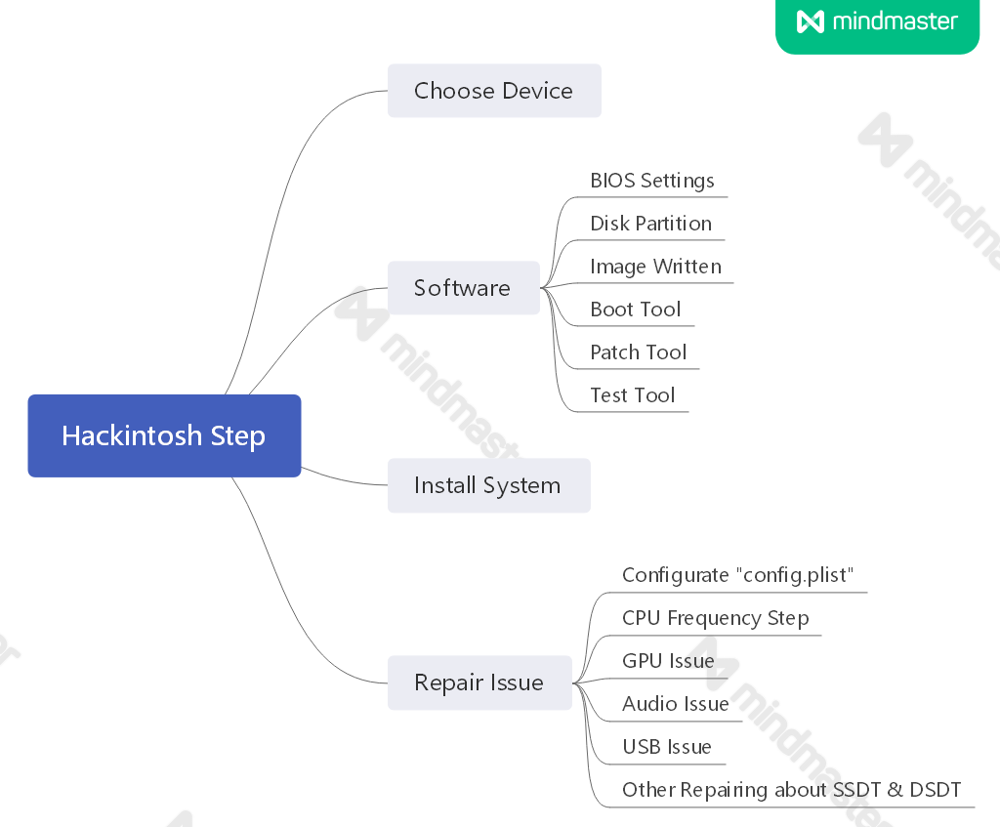

# __Installation Guide__
## __Content__
* [Before Installation](#Before-Installation)
* [BIOS Settings](#BIOS-Settings)
* [Choose 'config.plist'](#Choose-'config.plist')
* [Other Settings](#Other-Settings)
## __Before-Installation__
```diff
-   1.By now,you can't run hackintosh only with Integrated Graphic Card!
+   2.If you run hackintosh with core 10th generation processors,you can use your integrated graphic card for hardware decode.But you can't use the NVME Slot nearly CPU slot.
-   3.If you run hackintosh with core 11th generation processors,you can't use your integrated graphic card anymore.But you can use the Nvme Slot nearly CPU slot.
!   4.Be Patient
!   5.Studious and come up with a solution via all ways you can find(Search Engine,BBS,YouTube etc.)

- When you lost patience:
+   1.Buy a Mac
+   2.Go to reddit and pay some money
```
### __References__
* ***```Tutorial```***
  1. [**tonymacx86**](https://www.tonymacx86.com/)
  2. [**reddit**](https://www.reddit.com/r/hackintosh/)
  3. [**youtube**](https://www.youtube.com)
* ***```Hackintosh Step```***
  * 
## __BIOS-Settings__
```diff
+ Enabled
```
>**Advanced**
>>**CPU Configuration**
>>>**Intel (VMX) Virtualization Technology**

>>**USB Configuration**
>>>**XHCI Hand-off**

>>**PCI Subsystem Settings**
>>>**Above 4G Decoding**
```diff
- Disabled
```
---
>**Advanced**
>>**CPU Configuration**
>>>**C States**

>>**USB Configuration**  
>>>**Legacy Boot**

>>**Super I/O Configuration**  
>>>**Serial Port**

>>**Graphics Configuration**
>>>**VT-d**  
>>>**Primary Display*
```diff
!  if you use PEG Graphics Card with i3/i5/i7/i9-10xxx processors,please select 'Auto'
!  if you use PEG Graphics Card with i3/i5/i7/i9-10xxxf processors,please select 'PEG'
```
>>>**Internal Graphics**
```diff
!  close before you install MacOS
!  open after you finish your installation
```
>>>**DVMT Pre-Allocted**
>>>>**256MB**

>>>**DVMT Total GFX Mem**
>>>>**Max**

>>**Trusted Computing**
>>>**TPM 2.0 Support**

---
```diff
! if you use Maxsun iCraft-b560m with WiFi motherboard,you should do additional option:
```
>>**No Disk(PXE)**
>>>**Onboard WLAN Controller**  
>>>**Onboard Bluetooth Controller**
---


>**StartUp**
>>**Operating System Select**
```diff
-  Choose 'Manual' first,and set the option of 'CSM Support' to 'Disabled'
+  then:
!    choose 'Windows UEFI Mode' for run hackintosh with Windows
!    choose 'Others OS' for run hackintosh only
```
---
>>**Fast Boot**

>**Security**
>>**Secure Boot**  
>>>**Secure Boot Mode**
```diff
-  Choose 'Custom',and ensures all 'Key Source' items display 'No Keys',or you can choose a selected item to delete its key.
```
---
```diff
!  CFG Lock
+  Copy 'CFGLock.efi' to /EFI/OC/Tools,and Restart your computer(when you ready to install hackintosh)
+  You'll see 'CFGLock' in your OC Boot list
+  Use this tool to check the value of CFGLock(MSR 0xE2),for '0' is unlocked and '1' is locked,you can change the value by press 'Y'
-  After ensure CFGLock is unlocked,Open 'config.plist'
!  Set values as following:
```
```Json
  <key>Quirks</key>
		<dict>
			<key>AppleCpuPmCfgLock</key>
			<false/>
			<key>AppleXcpmCfgLock</key>
			<false/>
```      
## __Choose-'config.plist'__
```diff
!  Please rename your 'config.plist' file after you choose a specific 'config-XXX.plist' file.
```
* config-001.plist  
```Change Nothing```
* config-002.plist  
```Remove USB Port Customize```  

## __Other-Settings__
* ```Please reference: ```[Installation References](./Installation-References.md)
