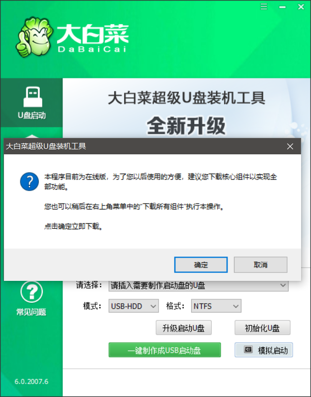
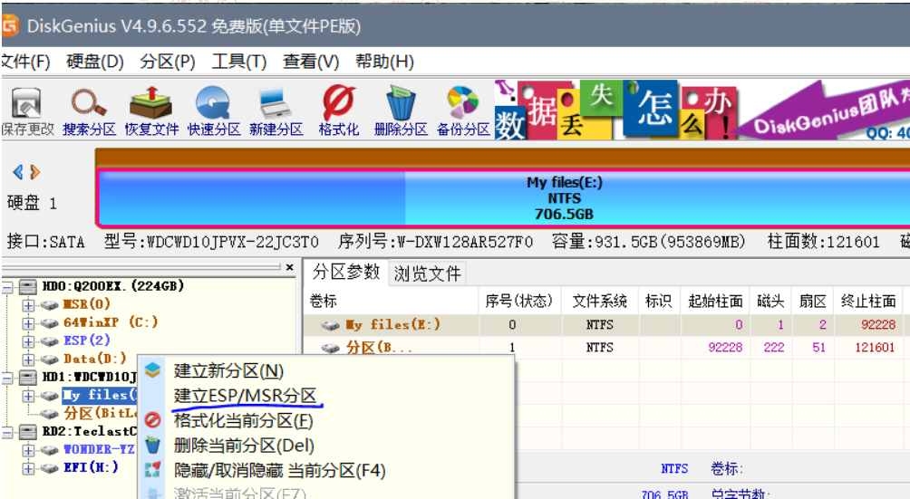
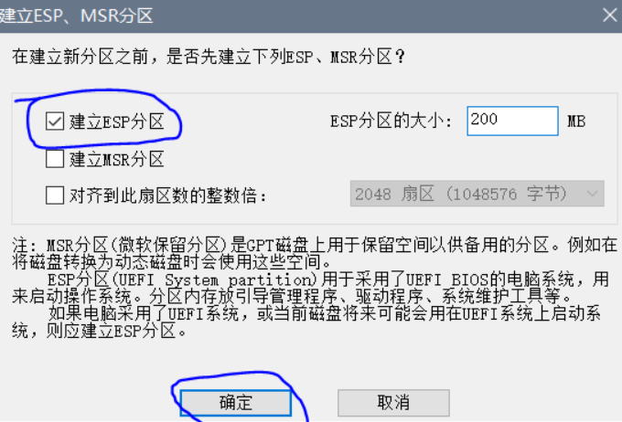
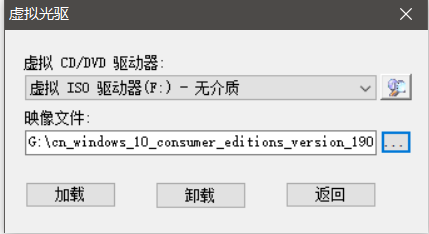
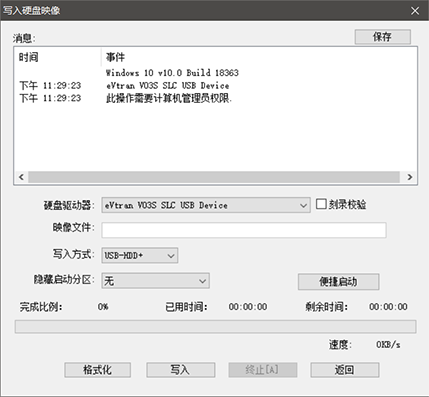
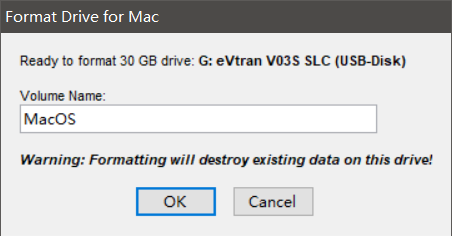
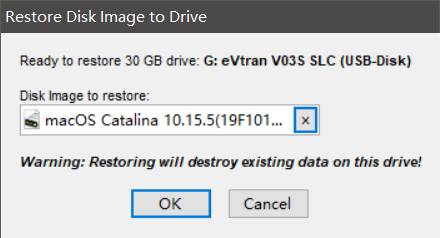
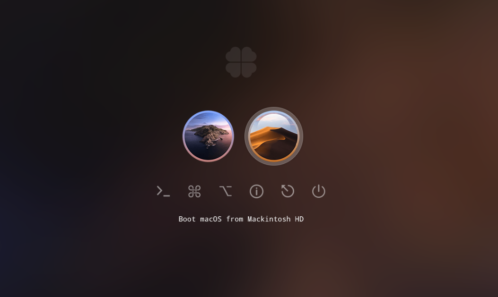

## **安装参考（中文版）**
***
```这个参考教程会告诉你如何打造一台完美的黑苹果```
## **目录**
* [安装前](#安装前)
* [参考](#参考)
* [件选择](#硬件选择)
  * [台式机](#台式机)
    * [CPU](#CPU)
    * [显卡](#显卡)
    * [主板](#主板)
    * [硬盘](#硬盘)
    * [内存](#内存)
    * [无线网卡和蓝牙](#无线网卡和蓝牙))
    * [准系统](#准系统)
  * [笔记本](#笔记本)
    * [CPU](#移动端处理器)
    * [显卡](#移动端显卡)
    * [主板](#移动端主板)
    * [移动端存储](#移动端存储)
    * [移动端内存](#移动端内存)
    * [笔记本无线网卡和蓝牙](#笔记本无线网卡和蓝牙))
* [BIOS设置](#BIOS设置)
  * [开启](#开启)
  * [关闭](#关闭)
* [硬盘分区](#硬盘分区)
  * [创建EFI分区](#创建EFI分区)
  * [卷分区](#卷分区)
* [Windows安装](#Windows安装)
* [MacOS安装](#MacOS安装)
  * [MacOS分区](#MacOS安装)
    * [引导工具](#引导工具)
    * [文件树](#文件树)
  * [安装步骤](#安装步骤)
    * [加载前](#加载前)
    * [加载中](#加载中)
    * [安装中](#安装中)
    * [安装后](#安装后)
* [补丁](#补丁)
  * [显卡](#显卡)
    * [核显](#核显)
      * [核显补丁](#核显补丁)
    * [独显](#独显)
      * [config.plist中的配置](#在config.plist中的配置)
      * [显示输出修复](#显示输出修复（补丁）)
  * [声卡](#声卡)
  * [USB](#USB端口)
    * [关闭USB端口限制](#关闭USB端口限制补丁)
      * [在config.plist文件中配置USB端口](#在'config.plist'文件中配置USB端口补丁)
    * [定制USB活动端口](#[定制USB活动端口)
  * [CPU](#CPU)
    * [CPU SSDT](#CPU_SSDT)
  * [其他特性](#其他特性)
    * [注入三码](#注入三码)
    * [iMessages和Facetime](#iMessage以及Facetime)
* [DSDT & SSDT](#DSDT和SSDT)
  * [DSDT](#DSDT)
    * [休眠唤醒修复]](#休眠唤醒修复)
  * [SSDT](#SSDT)
    * [笔记本亮度补丁](#笔记本亮度补丁)


## **安装前**
```diff
!   1.一定要耐心
!   2.好学并且通过一切手段去搜寻可能遇到的问题的解决方案
- 当你失去耐心时
+   1.买个白苹果
+   2.去taobao或者咸鱼花钱找人帮你装
```
## 参考
* ```教程```
  1. [**tonymacx86**](https://www.tonymacx86.com/)
  2. [**黑苹果乐园**](https://heipg.cn)
  3. [**黑果小兵的部落阁**](https://blog.daliansky.net/)
  4. [**哔哩哔哩**](https://bilibili.com)
* ```黑苹果安装步骤```
---
  * 
---
## **硬件选择**
```好的硬件选择等于成功了一半```
### __台式机__
#### CPU
```diff
推荐
+    1.Intel 9代酷睿 i3/i5/i7/i9系列(Coffee Lake)
+    2.Intel 8代酷睿 i3/i5/i7 系列(Coffee Lake)
+    3.Intel 4代酷睿 i3/i5/i7 系列以及 Intel 志强 E3-12XXV3 系列(Hasewell)
+    4.Intel 3代酷睿 i3/i5/i7 系列以及 Intel 志强 E3-12XXV2 系列(Ivy Bridge)
能支持
!   1.Intel 奔腾G系列(例如 G2030 G3260)
!   2.Intel 酷睿E系列(例如 E8400 E5800) 以及 Intel 酷睿 Q 系列(例如 Q9600)
!   3.Intel 赛扬 G 系列(例如 G1840)
!   4.AMD Ryzen 1代、2代、3代系列
!   5.AMD A系列APU(例如A10-7800 A10-9600)
别选
-   1.Intel 淩动系列(例如 D525 N330)
-   2.AMD Ryzen APU(例如 2200G 3400G)
-   3.Intel 赛扬 J 系列(例如 J1900) 以及 N 系列(例如 N4100)
#   上述未提及的CPU型号请自行搜索
```
#### 显卡
  1. 品牌
     ```diff
     推荐
     +  1.蓝宝石
     +  2.迪兰恒进
     +  3.话说
     能支持
     !  1.华擎
     别买
     -  1.讯景
     -  2.OEM定制卡
     ```
  2. 型号
     ```diff
     推荐
     +  1.Radeon RX5500XT/RX5600XT/RX5700
     +  2.Radeon RX560XT/RX590
     +  3.开普勒架构的Nvidia显卡(例如 GTX760 GTX690)
     +  4.Intel HD/UHD型号桌面端核显(除了11、12代核显)
     能支持
     !  1.麦克斯韦架构的Nvidia显卡(例如 GTX970 GTX1060)(需要WebDrive驱动并且最高支持到的系统版本是10.13.6)
     !  2.Radeon RX5700XT(可能需要黑屏补丁)
     !  3.Radeon RX460/RX470/RX480/RX560/RX570/RX580(2304SP)(矿卡多))
     Don't
     -  1.Radeon RX580 2048SP(设备ID 不是这个的 1002-67DF)
     -  2.Nvidia GTX16 系列 and RTX20 系列
     #  上述未提及的显卡型号请自行搜索
     ```
#### 主板
  1. 品牌
     ```diff
     推荐
     +  1.华硕
     +  2.华擎
     +  3.微星
     能支持
     !  1.昂达
     !  2.七彩虹
     !  3.铭瑄
     别买
     -  1.梅捷（BIOS支持不好）
     -  2.其他寨板
     ```
  2. 芯片组
     ```diff
     推荐
     +  1.Z390 芯片组
     +  2.Z370 芯片组
     +  3.B85 芯片组
     Can support
     !  1.B360 芯片组
     !  2.H310 芯片组
     !  3.B75 芯片组
     !  4.B450 芯片组
     !  5.H310 芯片组
     Don't
     -  老式 芯片组(例如 Intel 965 AMD A55)
     #  上述未提及的芯片组请自行搜索
     ```
#### 存储
```diff
推荐
+   1.三星 970 EVO(NVME)
+   2.西数 SN730(NVME)
+   3.铠侠 RC10(NVME)
+   4.镁光 MX500(SATA)
+   5.三星 860 EVO(SATA)
+   6.铠侠 TC10(SATA)
别买
-   1.三星 970 EVO Plus(NVME)
-   2.三星 PM981/PM981A(NVME)
-   3.Intel Optane Series(NVME)
-   4.Intel 660P QLC(NVME)
```
#### 内存
```diff
推荐
+   1.金士顿
+   2.镁光
+   3.科赋
别买
-   1.三星
-   2.海盗船
-   3.杂牌(such as 酷兽)
```
#### 无线网卡和蓝牙
```diff
推荐
+   1.博通 943602CS (2.4G/450Mbps 5G/1300Mbps 蓝牙 4.2)
+   2.博通 94360CD  (Fenvi T919) (2.4G/450Mbps 5G/1300Mbps 蓝牙 4.0)
+   3.博通 94360CS2 (2.4G/450Mbps 5G/867Mbps Bluetooth 4.0)
能支持
!   1.博通 94350ZAE (DW1820A)(2.4G/300Mbps 5G/867Mbps Bluetooth 4.1)
!   2.Intel AX 系列(such as AX200)
!   3.Intel AC 系列(such as 9260ac 3160ac)

#  上述未提及的无线网卡请自行搜索
```
#### 准系统
```diff
+   1.Intel NUC8 系列
+   2.华擎 Deskmini310 系列
```
### __笔记本__
  * [长期支持笔记本列表](https://blog.daliansky.net/Hackintosh-long-term-maintenance-model-checklist.html)
#### 移动端CPU
```diff
+   Intel Core i3/i5/i7 移动端系列
-   Intel 凌动系列(例如 N270)
-   AMD Ryzen 4 系列移动端CPU(例如 4600U)
#   上述未提及的CPU请自行搜索
```
#### 移动端显卡
```diff
-   几乎所有的AMD和Nvidia移动端显卡都不被支持
+   Intel GMA/HD/UHD 系列移动端核显
+   Nvidia Geforce GT320m独显
+   Nvidia Geforce 9400m独显
#   上述未提及的显卡请自行搜索
```
#### 移动端主板
* ``` 取决于你的CPU ```
#### 移动端存储
* [台式机存储)](#存储)
#### 移动端内存
```diff
-   某些型号的LPDDR4内存可能导致崩溃
```
#### 移动端无线网卡和蓝牙
* [桌面端无线网卡和蓝牙](#无线网卡和蓝牙)
## BIOS设置
### 开启
```diff
!   某些主板可能不包括下列选项，如果你的安装过程正常。你可以忽略他们或者你需要打补丁 
+   1.VT-x
+   2.Exective Disable bit
+   3.iGPU(only use iGPU or multi-monitor) / IGFX
+   4.Above 4G decoding
+   5.XHCI-Handoff
```
### 关闭
```diff
-   1.Fast Boot
-   2.CSM
-   3.CFG Lock
-   4.Secure-Boot
-   5.VT-d
-   6.Boot Option -- OS Type -- Other
-   7.Onboard Wi-Fi and Bluetooth
```
## **硬盘分区**
```diff
!   我们假定你有一台新电脑
!   如果你已经拥有了一台装有windows系统的电脑，请备份你的数据！
```
### __创建EFI分区__
```diff
!     通常情况下，windows系统会分配120兆空间给EFI分区
      1.下载 '大白菜安装工具'
```
*   [大白菜安装工具](https://pan.baidu.com/s/1HTCgWwzTIrK9V_VYv7olWw)  
    **访问密码: 0iob**
```
      2.打开并下载所有组件然后单击确定
      3.等待下载(可能需要花费5分钟)
```

```diff
!     进行下列步骤前，你必须备份你的数据！
      4.插上你的U盘，单击(一键制作成USB启动盘)
      5.等待镜像制作
      6.重启并进入WinPE系统
      7.打开 'Diskgenius.exe'
      8.选择你想要安装MacOS和Windows的硬盘
```

```
      9.Partition(分区) --- create ESP(EFI)/MSR partition(建立ESP/MSR分区)
```

```diff
!     你可以将你的EFI分区大小范围设定在350兆至500兆之间
      10.修改 ESP(EFI) 分区的大小
```

```
      11.单击 'OK'
```
### __卷分区__
```diff
+     你可以将你的磁盘分为3个区(假定你的磁盘是500G大小465G的可用空间)
+     Windows:  2个分区 (C(120GB) and D(144GB))
+     MacOS:  1个分区(MacOS(200GB))
```
* ```Windows 分区``` 
```
      1.Partition(分区) --- create new partition(创建新分区)
```

```diff
      2.File system(文件系统类型) --- NTFS
      3.输入你想要分区的大小
      4.单击 'Ok'(确定)
      5.单击 F8(Save partition table)(保存分区表)
      6.Partition --- format current partition(格式化当前分区)
+     Recommand cluster size is 4096 bytes
      7.单击 'Format'*(格式化)
```
  
* ```MacOS 分区```
```diff
-     不要格式化卷
+     使用MacOS自带的磁盘工具来替代
```
## __Windows安装__
```diff
!     你需要额外的电脑来写入镜像
-     不要用大白菜(Ghost)来安装windows
```
  * ```下载windows原版镜像```  
      * [Windows 10 零售版 X64] (ed2k://|file|cn_windows_10_consumer_editions_version_1909_updated_jan_2020_x64_dvd_47161f17.iso|5417457664|274FEBA5BF0C874C291674182FA9C851|/)(```内存大小4G以上```)
      * [Windows 10 零售版 X86] (ed2k://|file|cn_windows_10_consumer_editions_version_1909_updated_jan_2020_x86_dvd_9c50652f.iso|3884539904|0F2E887F2845BCD5C61E99E74D717287|/)(```内存大小4G以下```)
  * ```下载 UltraISO```
      * [UltraISO 9.72](https://pan.baidu.com/s/1BYKaktRlW_fiEIVJ4Tju8w)  
        **访问密码: en9v**  
  * ```装载镜像```  
  ```  
        1. 使用管理员模式打开 'UltraISO.exe'
        2. 按 F6(装载到虚拟的DVD-ROM分区)
        3. 选择镜像文件
        4. 单击 mount(加载)
  ```  

  ```
        5.选择 start(启动)
        6.Write harddisk image(写入硬盘映像)
  ```

  ```diff
  !     下个步骤前，你必须备份你的文件！你的U盘会被格式化！
        7.选择 write(写入)
        8.重启电脑等待引导
        9.按照Windows的安装程序的指引完成安装
  ```
* ```现在你的电脑已经运行在Windows 10上```
## __MacOS安装__
```diff
!   下一步前，你需要另外一个U盘（U盘的可用容量大于或等于16G）
```
### MacOS分区
* ```MacOS卷介绍```

|卷标|功能|文件系统|
|:------|:------|:-----|
|WinPE|Windows恢复分区|FAT32|
|Boot Tool|MacOS和Windows引导工具分区|FAT32|
|MacOS|MacOS安装镜像分区|APFS(Mac OS 10.14+) / HFS+|
|Data1|Windows和MacOS文件交换分区|FAT32|
|Data2|功能同'Data1'|FAT32|
```diff
-  MacOS 10.14以上版本的系统不支持NTFS格式磁盘的写入，但是可以读取NTFS磁盘的数据
!  如果你下载了文件名为'MacOS_Clover'或者'MacOS_OC'的镜像文件，你可以直接跳转到MacOS卷中
```
```diff
+      你可以将你的U盘划分为5个分区(假定你的U盘大小为32G，29.7G可用空间)
+      WinPE: 200MB
+      Boot Tool: 100MB
+      MacOS: 10GB
+      Data1:13GB  (16GB U盘:4GB)
+      Data2:6.1GB  (16GB U盘:不要该分区)
```
  * [卷分区](#卷分区)
```diff
-     不要格式化卷 'MacOS'
```
* ```卷'MacOS'```
```
      1.下载 'TransMac' 并安装
```
[TransMac V12.5](https://pan.baidu.com/s/1k-8-YrMcY4_JYbvHQAz8TQ)  
__访问密码: 07hv__

```diff 
      2.下载 MacOS 镜像(*.dmg)
```
[MacOS_Catalina_10.15_Clover](https://pan.baidu.com/s/1wDD7ZeyrCQxZxzUuhrauSw)  
**访问密码: eht4**  
**解压密码: imac.hk**  
```
      3.以管理员模式打开TransMac
      4.选择你的U盘 --- 右键单击 --- 格式化为MacOS分区
      5.输入你喜欢的卷名
```

```diff
!     如果发生错误，你可以把你的U盘插在机箱后面的USB接口上
!     下个步骤前你必须备份你的文件，你的U盘将被格式化
      6.单击 'OK'
      7.选择U盘 --- 右键单击 --- 恢复磁盘镜像
      8.单击 'Yes'
```

```diff
      9.单击 'OK'
      10.等待镜像写入完毕，这个过程可能需要花费超过20分钟
+     当你的卷标是'MacOS_XXX_Clover' 或者 'MacOS_XXX_OC'时表示已经完成写入
!     11.重启电脑进入Clover或者OC引导
+     当你的卷标名是'MacOS_XXX'时
!     11.下载 Clover并解压
!     12.打开'Clover-XXXX-X64.iso'
!     13.使用'UltraISO'并将它挂载到虚拟的DVD-ROM光驱里面
!     14.将它拷贝至“引导工具”卷
```

#### 引导工具
|引导工具名称|特点|
|-----|-------|
|Clover|稳定的 'config.plist' 以及易于配置的图形化界面|
|OC|没有图形化界面，采用了新的标准并且支持更新的硬件|



```
      12.单击左键并且选择从XXX分区引导MacOS(XXX 是你的卷标)
      13.在跑码完成后进入MacOS安装向导
```
#### 文件树(clover & OC)
>___Clover___
>>___ACPI___
>>>***origin***  (存放原始的SSDT和DSDT文件,在引导界面单击F4可以保存)  
>>>***patched***  (存放更改后的SSDT以及DSDT文件)  

>>***drivers***
>>>***off***  (存放EFI文件备份)  
>>>***UEFI***  (存放UEFI引导需要的efi文件)  
>>>***Boot***  (存放Legacy引导模式所需要的efi文件)  

>>***kext***  (存放注入到核心中的设备文件，类似于驱动)

>>***tool***  (存放clover引导中需要用到的实用工具，例如shell)

>***CLOVERX64.efi*** (主引导文件)

>***config.plist*** (主配置文件)

[**如何配置OC引导**](https://blog.daliansky.net/OpenCore-BootLoader.html)
### **Installation-Step**
_小贴士:_
```diff
-     不同系统版本的.efi文件可能不兼容
```
#### 加载前
```diff
+     如果你的MacOS系统版本高于10.13.6，你可能需要下列补丁
!     MacOS已经在DSDT文件中改变了它们的名字
```
|补丁名称|找寻字段|替换字段|
|:----|-----:|-----:|
|_STA to XSTA|5F535441|58535441|
|EHC1 to EH01|45484331|45483031|
|EHC2 to EH02|45484332|45483032|
|XHCI to XHC|58484349|5848435F|
|XHC1 to XHC|58484331|5848435F|  

```定位到'config.plist'中```

```diff
<key>ACPI</key>
      ...
      <key><DSDT></key>
      ...  
            <key>Patches</key>
            <array>
                  <dict>
+                       /*add here*/
                        ...
                  </dict>
            </array>
```
```示例补丁```
```
      <key>Comment</key>
      <string>_STA  to XSTA</string>
      <key>Disabled</key>                          #disabled the patch
      <false/>          
      <key>Find</key>
      <data>X1NUQQ==</data>
      <key>Replace</key>
      <data>WFNUQQ==</data>
      <key>TgtBridge</key>
      <data>UlRDXw==</data>
```
#### 系统加载中
```diff
!     可能发生的错误:
-     1.系统加载时黑屏
+     更新你的“WhateverGreen.kext”文件到一个更新的版本
-     2.显示 '+++++++' or 类似的符号
+     将 '/Clover/EFI/drivers/UEFI/OsxAptioFix3Drv.efi' 替换为 'Clover/EFI/drivers/off/OsxAptioFixDrv.efi'
-     3.显示'kernel Panic'或其他类似的符号
+     缺少 kext 文件,请添加你硬件设备必须的kext文件
-     4.显示 '禁止' 符号
+     请替换你在/Clover/EFI/drivers/UEFI中的文件
```
#### 安装过程中
```diff
+    1.选择 '磁盘使用工具'
+    2.显示所有卷
+    3.抹除（抹去）卷
+    4.文件系统选择 Mac OS X 扩展(日志式)
-    不要选择APFS作为文件系统
+    5.跟随MacOS安装向导
-    可能发生的错误：
-    安装程序在最后两分钟停止运行
+    断网
+    把'AptioMemoryFix.efi'替换为'OsxAptioFixDrv.efi'或者是'OsxAptioFixDrv3.efi'
+    选择32GB容量的U盘作为你的安装U盘，或者改用机箱的后置USB接口
```
_小贴士_:
```diff
     不要选择“发送诊断报告”
     不要选择发送“Siri的音轨”
```
[**WhateverGreen v1.4.0**](https://github.com/acidanthera/WhateverGreen/releases/下载/1.4.0/WhateverGreen-1.4.0-RELEASE.zip)  
**其他错误请参考:**  
[**安装过程中的错误**](https://blog.daliansky.net/Common-problems-and-solutions-in-macOS-Catalina-10.15-installation.html)

#### 安装后
* ```装载'EFI'volume```
```      
      1.选择你安装的MacOS的EFI分区
      2.在EFI分区中单击“装载EFI分区”
      3.输入你的MacOS密码并且装载分区
      4.拷贝Clover文件夹下的所有文件到EFI分区中
```


* ```添加引导项```
```
      1.下载 'EasyUEFI Pro'
```
[**EasyUEFI Pro**](https://pan.baidu.com/s/1VLMBP_YboaYfYxk2oJ8y6A)  
__Code: 75nw__
```
      2.选择 '管理UEFI引导项目'
      3.单击 '+' 来添加项目
      4.OS type 选择 'Linux and other OS'
      5.输入 'Clover' as 引导项名称
      6.选择 'EFI/Clover/CLOVERX64.efi'作为文件路径
      7.改变项目优先级
```
## **补丁**
### **显卡**
#### 核显  
```diff
+    1.下载 'Hackintool'并解压
```
[**HackinTool**](https://pan.baidu.com/s/1_VvPcK-v1pyL3xPI5A42vw)  
__访问密码: h4oa__
```diff
!    2.打开终端并输入  
     cd /Users/username/下载s(your user name)
     sudo cp Hackintool.app ~/Applications
```
```diff
     3.打开'HackinTool'
     4.选择 'System' 栏
-    如果你的 'platform-id' 以及 'generation' 选项显示 '???' 那么你需要补丁
```
##### 核显补丁
* ```你可以从下列选项中选择一个:```
* ```使用 Hackintool```
```diff
      1.选择 'Patch 列表'
      2.选择 匹配你CPU的Intel处理器代数（例如7代处理器、8代处理器）
```
```
      3.选择匹配你核显的‘Platform-id’
```
**请参考:**
[__Platform-id__](https://blog.daliansky.net/Intel-core-display-platformID-finishing.html)

```
      4.选择 'Patch'(在连接核显后)
      5.单击 'Generation'(生成)并拷贝代码
      6.下载 'XCode'  或者  'PlistEditPro'
      7.新建文件并粘贴代码
      8.把这个文件重命名为'xxx.plist'
      9.使用 'XCode' 或者 'PlistEditPro' 打开该文件以及'config.plist'
```
```定位'config.plist'到 ```
```json
      <key>Devices</key>
            <key>Properties</key>
                  /*add here*/
```
```
            10.Restart your computer
```  
_小贴士_:
当你在'config.plist'中填充数据时,你需要:
```diff
+           1.把你的数据每两位进行分割
+           2.分割后每两位数据进行反转
+           3.把该数据从十六进制转换为Base64格式
+           4.你可以使用Hackintool中的Calc选项卡中的工具
```
#### 独显
##### 在'config.plist'中的配置
```
      <key>Devices</key>
      ...
            <key>Graphics</key>
```
* ```免驱显卡```
```diff
      <key>Devices</key>
      ...
            <key>Graphics</key>
            <dict>
                  <key>EDID</key>
                        <Inject>
!                       <false/>
            </dict>
            <key>Inject</key>
		<dict>
			<key>ATI</key>
			<false/>
			<key>Intel</key>
			<false/>
			<key>NVidia</key>
!     		<false/>
		</dict>
      ...
```
* ```支持的设备```  
```需要的WebDriver驱动```
[__WebDriver 1.18__](https://pan.baidu.com/s/1f-D7_qvkIfoohw5biJPpEg)  
**访问密码: ms74**
```diff
      <key>Devices</key>
      ...
            <key>Graphics</key>
            <dict>
                  <key>EDID</key>
                        <Inject>
!                       <true/>
            </dict>
            <key>Inject</key>
		<dict>
			<key>ATI</key>
			<false/>
			<key>Intel</key>
			<false/>
			<key>NVidia</key>
!     		<true/>
		</dict>
      ...
```
##### 显示输出修复（补丁）
* ```修复端口```
```diff
!     它可以帮助你修复紫屏问题
      1.下载 'IORegistryExplorer'
```
[__IORegistryExplorer__](https://pan.baidu.com/s/1ZX7Y4xOqt2tWT48XwOQKGQ)  
**访问密码: wdpz**  
**解压密码: heipg.cn**
```
      2.定位到独显路径(such as PCI(0x0)/PCI(0x1a,0x1))
```

```
      3.定位到'Display 0'选项卡
      4.检查 'connection-type'
      5.按下表中说明修复
```

|端口名称|十六进制|Connection-type|反转|
|:-----|-----:|-----:|-----:|
|DP|0x400|00 00 04 00|00 40 00 00|
|HDMI|0x800|00 00 08 00|00 80 00 00|
|DVI|0x04|00 00 00 04|40 00 00 00|

### __声卡__
* ```声卡注入(use AppleALC.kext)```
```
      1.打开 'Hackintool'
      2.选择 'Sound（声音）' 选项卡
      3.单击锁图标去解锁
      4.选择正确的 ALC layout-id
      5.单击锁图标来锁上它
```
      
      你也可以在'config.plist'中改变它的值

```diff
      ...
      <key>Audio</key>
		<dict>
			<key>AFGLowPowerState</key>
			<false/>
			<key>Inject</key>
!     		<integer>7</integer>
			<key>ResetHDA</key>
			<false/>
                  ...
```

* ```VoodooHDA 注入```  
```diff
+    一些声卡型号像瑞昱 ALC881,ALC887 可能需要
```
**请参考**:  
[voodooHDA 注入](https://www.youtube.com/watch?v=yqrET5Skpm0)


### __USB 端口__
```diff
!      除了大部分Z370和Z390主板，其他主板你基本上都需要对USB端口进行补丁
!      如果你没有打端口补丁，MacOS系统无法识别你的USB控制集线器
```
#### __关闭USB端口限制补丁__
```从15个端口到超过26个短暗扣(MacOS 10.13.6+)```
* ```300 系列主板```

|补丁名称|寻找字段|替换字段|
|:-----|:-----|:-----|
|Apple USB XHCI|837D940F 0F839704 0000|837D941A 90909090 9090|
|Apple USB XHCI|837D880F 0F83A704 0000|837D880F 90909090 9090|
|iOkitUSBFamily|83FB0F0F|83FB3F0F|
|iOkitUSBFamily|83E30FD3|83E33FD3|
|Driver USB Apple USB XHCI|83F90F0F|83F93F3F|
|Driver USB Apple USB XHCI|83FB0F0F|83FB3F3F|
|Driver USB Apple USB XHCI|83FF0F0F|83FF3F3F|

##### 在'config.plist'中配置USB端口补丁
```diff
      <key>KernelAndKextPatches</key>
      <dict>
      ...
            <key>KernelAndKextPatches</key>
            <array>
               <dict>
+                   /*add here*/
               </dict>
            </array>
	<dict>
```
```diff
!    补丁前请使用'Hackintool'将十六进制数据转换为Base64数据
      ...
      <dict>
            <key>Comment</key>
            <string>USB Port limit patch 10.14.x modify by DalianSky(credits PMheart)</string>
            <key>Disabled</key>
            <false/>
            <key>Find</key>
!           <data>g/sPDw==</data>
            <key>InfoPlistPatch</key>
!           <false/>
            <key>Name</key>
            <string>com.apple.driver.usb.AppleUSBXHCI</string>
            <key>Replace</key>
!           <data>g/s/Dw==</data>
      </dict>
      ...
````
* ```100或者200系的主板```
```diff
!       请自行查找
```

#### 定制USB活动端口
```diff
           1.打开 'Hackintool'
           2.选择 'USB' 选项卡
           3.找到标记为绿色的USB端口
           4.插入你的U盘来找到端口名称
!          USB 3.0 会是类似于'SS XX'的格式
!          USB 2.0 会是类似于'HS XX'的格式
!          主板上的USB设备，请把它的连接类型设置为'internal'
!          鼠标和键盘设备，请把它的连接类型设置为'internal'
-          USB端口不包括Type-C端口
```

* ```例子```

|端口名称|连接类型|连接设备|设备速度|备注|
|:-----|:-----|:-----|:-----|:-----|
|SS01|USB3|USB Flash Disk|5.0Gbps|USB Flash Disk|
|HS05|Internal|Keyboard|12Mbps|Your Keyboard|
|HS06|Internal|Bluetooth|12Mbps|Bluetooth onboard|
|HS10|USB2|USB Flash Disk2|480Mbps|USB Flash Disk|


```diff
            5.单击 '一'按钮来删除未使用到的USB端口
            6.单击 '->' 按钮来导出定制USB文件
            7.装载'EFI'分区
            8.将 'USBPort.kext' 拷贝到 /Clover/kext/Other
```
### **CPU**
* ```检查CPU睿频```
```
            1.下载 'Intel Power Gadget'
```
[**Intel Power Gadget**](https://pan.baidu.com/s/1NDmy3ue7GSeyMRwNu9_ZGQ)  
**访问密码: 1dzu**
```diff
            2.打开它
!           可能发生的错误
-           你电脑重启并且显示了错误
+           将'EmuVariableUefi.efi'从"/Clover/driver/off"拷贝到"/Clover/driver/UEFI"下
+           找一个旧一些的软件版本
            3.如果CPU频率曲线异常，你需要给CPU电源管理进行补丁
-           不要使用CPU-S实用工具，它可能不适合Skylake（酷睿6代）以上的处理器设备
-           并且CPU-S也可能和Intel Power Gadget产生冲突
```
#### CPU_SSDT
```diff
            1.下载 'one-key-CPUFriend'
!           你必须 'README' 
            2.遵从 README指南
            3.将 'CPUFriend.kext' 拷贝到 /Clover/kext/Other目录下
```
[**one-key-CPUFriend**](https://github.com/stevezhengshiqi/one-key-cpufriend)

### **其他特性**
#### __注入三码__
```diff
-           如果你无法登陆iMessage和Facetime，请检查你的三码
            1.打开 'Clover Configuration'
            2.选择 'Machine Settings'
            3.定位到系统选项
```
```diff
+           1.'serial-number' 选项卡, 单击生成新的
+           2.在苹果网站上检查这个序列号,如果这个序列号是无效的那么进行下一步
+           3.'smUUID' 选项卡，单击生成新的
            4.选择 'ROM Settings'（ROM设置）
            5.单击 'generate'（生成）
            6.将MLB选项卡对应的MLB文本框中的数值拷贝到ROM选项卡对应的MLB文本框中
            7.拷贝SmUUID文本框中的值
            8.选择'Variable Settings'
            9.粘贴 'Custom UUID' 选项卡中的 'SmUUID'
            10.保存 'config.plist'文件
!           你也可以参考下列视频
```
[__黑苹果注入三码__](https://www.bilibili.com/video/BV19i4y1x768?from=search&seid=18408673921607091745)

#### __iMessage以及Facetime__
```diff
!           如果你无法登陆iMessage以及Facetime，请按照下列解决方案尝试：
```
* ```清空 Nvram```
```diff
            1.使用 'Hackintool'
!           2.刷 BIOS
```
* ```检查 'ROM' 和 'Board-id'```
```diff
            1.打开 'Hackintool'
!           如果它在'ROM'和'Board-id'这两栏中显示 '???' ,请首先检查’config.plist‘
+           定位到 'config.plist'
```
```diff
      <key>RtVariables</key>
	<dict>
            ...
            <key>ROM</key>
!		<data>XXXXXXXXXXXX</data>
-           如果这个值是空的，请按照注入步骤重试
+           检查board-id

      </dict>
      ...
      <key>SMBIOS</key>
      <dict>
            ...
            <<key>Board-ID</key>
!           <string>Mac-AA95B1DDAB278B95</string>>
      </dict>
-           如果这个值是空的，请按照注入步骤重试
```
* ```替换 EFI 文件```
```diff
-           进行下列步骤前，请备份你的EFI文件！
-           'OsxAptioFixDrv.efi' 可能导致 clover 不能 从 'config.plist'中加载 'ROM'和'Board-id'的数据
+           replace 'OsxAptioFixDrv.efi' with 'ApitoMemoryFix.efi'
```

## **DSDT和SSDT**
### __DSDT__
* ```生成DSDT 和 SSDT 文件```
```diff
            1.单击 'F4' 当显示 'Clover Boot Options'（Clover引导选项）
            2.装载 'EFI' 分区
            3.在 in '/Clover/ACPI/origin目录下找到对应的文件
```
* ```准备编译工具```
```diff
            1.下载并解压 'MaciASL' 然后将它拷贝至/usr/Applications
            2.使用 'MaciASL' 打开 *.aml 文件
-           不要用MaciASL编译*.dsl文件，可能会引起错误
            3.下载 'iasl' 编译器
            4.copy 'iasl' to '/usr/bin'
-           如果它提示编译失败:
!           你可以在Windows下编译它
```
[__MaciASL__](https://pan.baidu.com/s/10bcCwChZKalwVr0uH8w_Yg)  
__访问密码: fkgr__  
[__iASL__](https://pan.baidu.com/s/1SQyHmCLr8shcfuNuer96aA)  
__访问密码: bi5g__  
```diff
-           按下列方法反编译 *.aml文件
+           iasl -dl *.aml(针对酷睿6代或者6代以上的处理器)
+           iasl -dl -da *.aml
            5.得到 '*.dsl' 文件
            6.文字编辑器打开它(such as Vim,EditPlus)
+           iasl *.dsl
            7.找到错误信息
+           8.使用 'iasl *.dsl' 命令来重新编译
```
              
#### 休眠唤醒修复
```diff
!           修复挡点击休眠按钮后立刻唤醒
            1.打开 '终端'
            2.键入 log show --start 'YYYY-MM-DD HH:MM:SS' --end 'YYYY-MM-DD HH:MM:SS' | grep 'Wake reason'
!           --start 以及 --end 代表了你想要获得日志的时间
!           3.if 终端显示: YYYY-MM-DD HH:MM:SS Wake reason: XHI ...等等.
            3.打开 DSDT.dsl
            4.查找终端中显示的'XHI ...'字段
            5.找到Method(_PRW)入口 

!           如果Method(_PRW) 的代码像下面一样:
```
```diff
!           0x6D or 0x60 取决于你的DSDT文件 
            Method (_PRW, 0, NotSerialized)  // _PRW: Power Resources for Wake
            {
-               Return (GPRW (0x6D, 0x04))
            }
```
替换为：
```diff
            Method (_PRW, 0, NotSerialized)  // _PRW: Power Resources for Wake
            {
+               Return (GPRW (0x09, 0x04))
            }
```
```diff
            6.单击休眠并且再次查找'唤醒原因'
!           如果唤醒原因和之前一样，用下列代码段落替换对应文件中的代码段
```
```diff
            Method (_PRW, 0, NotSerialized)  // _PRW: Power Resources for Wake
            {
-               Return (GPRW (0x6D, 0x00))
            }
-           你无法再通过USB设备唤醒了（例如USB鼠标等）
```
```         7.使用'iasl' 编译修改后的 '*.dsl'
            8.将文件拷贝至 /Clover/ACPI/patched/目录下
```
### __SSDT__
#### 笔记本亮度补丁
```diff
            1.使用iasl工具反编译 'SSDT-*.aml'
-           不要反编译 'SSDT-x0/x1...' .aml文件，你可以删除它们。
            2.再次编译 'SSDT-*.aml'并寻找错误
            3.使用'MaciASL' 打开'SSDT-*.aml'
            4.选择 'Patch'
            5.在补丁列表中找到正确的补丁
            6.单击'接受'
            7.保存为 *.aml file
!           在 'config.plist'中:
```
```diff
      <key>ACPI</key>
      <dict>
            ...
            <key><SSDT></key>
            <array>
                  <key>DropOem</key>
+      			<true/>                    #drop OEM_SSDT
                  ...
            <array>
            ...
            <key>SortedOrder</key>
		<array>
+                 /ssdt-file list/
           	<array>
            ...
      </dict>
!           请按照以下顺序重命名你的SSDT文件
!           SSDT-0,SSDT-1...
```
* ```例子```
```diff               
+           <string>SSDT-1.aml</string>
```
                 
