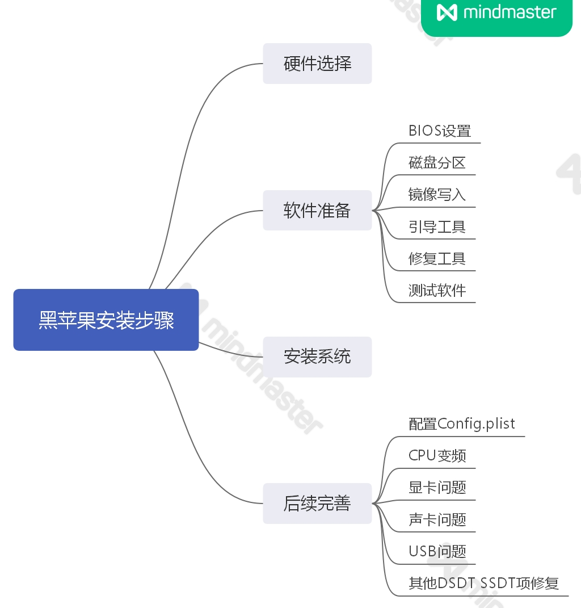

# __安装指南__
## __目录__
* [安装前准备](#安装前准备)
* [BIOS设置](#BIOS设置)
* [选择‘config.plist'文件](#选择‘config.plist'文件)
* [其他设置](#其他设置)
## __Before-Installation__
```diff
-   1.截至到现在，你并不能单独使用核显来运行黑苹果系统
+   2.如果你用得是10代酷睿处理器，你可以把核显用于硬件解码，但是无法使用主板上靠近CPU的NVME插槽
-   3.如果你用得是11代酷睿处理器，你无法将核显用于硬件解码，但是可以使用主板上靠近CPU的NVME插槽
!   4.一定要耐心
!   5.好学，并且通过一切可用的手段来搜寻问题的解决答案
- 当你失去耐心时:
+   1.买个白苹果
+   2.去taobao或者咸鱼找人帮你装
```
### __参考资料__
* ***```黑苹果教程```***
  1. [**tonymacx86**](https://www.tonymacx86.com/)
  2. [**黑苹果乐园**](https://heipg.cn)
  3. [**黑果小兵的部落阁**](https://blog.daliansky.net/)
  4. [**哔哩哔哩**](https://bilibili.com)
* ***```黑苹果步骤```***
  * 
## __BIOS设置__
```diff
+ 打开
```
>**Advanced**
>>**CPU Configuration**
>>>**Intel (VMX) Virtualization Technology**

>>**USB Configuration**
>>>**XHCI Hand-off**

>>**PCI Subsystem Settings**
>>>**Above 4G Decoding**
```diff
- 关闭
```
---
>**Advanced**
>>**CPU Configuration**
>>>**C States**

>>**USB Configuration**  
>>>**Legacy Boot**

>>**Super I/O Configuration**  
>>>**Serial Port**

>>**Graphics Configuration**
>>>**VT-d**  
>>>**Primary Display*
```diff
!  如果你希望使用处理器中的核显，请将这项设置为'Auto'
!  如果你使用的是没有核显的处理器，请将这项设置为'PEG'
```
>>>**Internal Graphics**
```diff
!  close before you install MacOS
!  open after you finish your installation
```
>>>**DVMT Pre-Allocted**
>>>>**256MB**

>>>**DVMT Total GFX Mem**
>>>>**Max**

>>**Trusted Computing**
>>>**TPM 2.0 Support**

---
```diff
! 如果你使用的是铭瑄b560m电竞之心WiFi版本的主板，你还需要进行以下的步骤:
```
>>**No Disk(PXE)**
>>>**Onboard WLAN Controller**  
>>>**Onboard Bluetooth Controller**
---


>**StartUp**
>>**Operating System Select**
```diff
-  首先选择'Manual'选项，然后将CSM Support设置为'Disabled'选项
+  然后:
!    如果要运行Windows和黑苹果双系统，选择 'Windows UEFI Mode'
!    如果仅仅运行黑苹果，选择'Others OS'
```
---
>>**Fast Boot**

>**Security**
>>**Secure Boot**  
>>>**Secure Boot Mode**
```diff
-  选择 'Custom',并且确保所有的'Key Source' 选项显示'No Keys',否则的话你可以选中其中显示不为'No Keys'的选项卡并且进入后删除Keys
```
---
```diff
!  CFG Lock
+  拷贝 'CFGLock.efi' 至 /EFI/OC/Tools目录下,并且重启电脑（挡你准备好安装黑苹果系统时，你会发现该工具出现在OC的引导菜单上）
+  使用这个工具来检查CFG锁的值(MSR 0xE2),0代表已解锁，1代表未解锁。按'Y'键来改变这个值
-  确保CFG锁解锁后,打开 'config.plist'文件
!  按以下提示设置值:
```
```Json
  <key>Quirks</key>
		<dict>
			<key>AppleCpuPmCfgLock</key>
			<false/>
			<key>AppleXcpmCfgLock</key>
			<false/>
```      
## __选择-'config.plist'__
```diff
!  当你选定了一个'config-xxx.plist'文件后，请将其重命名为’config.plist‘
```
* config-001.plist  
```原始版本```
* config-002.plist  
```移除了USB端口定制```  

## __其他设置__
* ```请参考:```[安装参考(中文版)](./安装参考(中文版).md)
